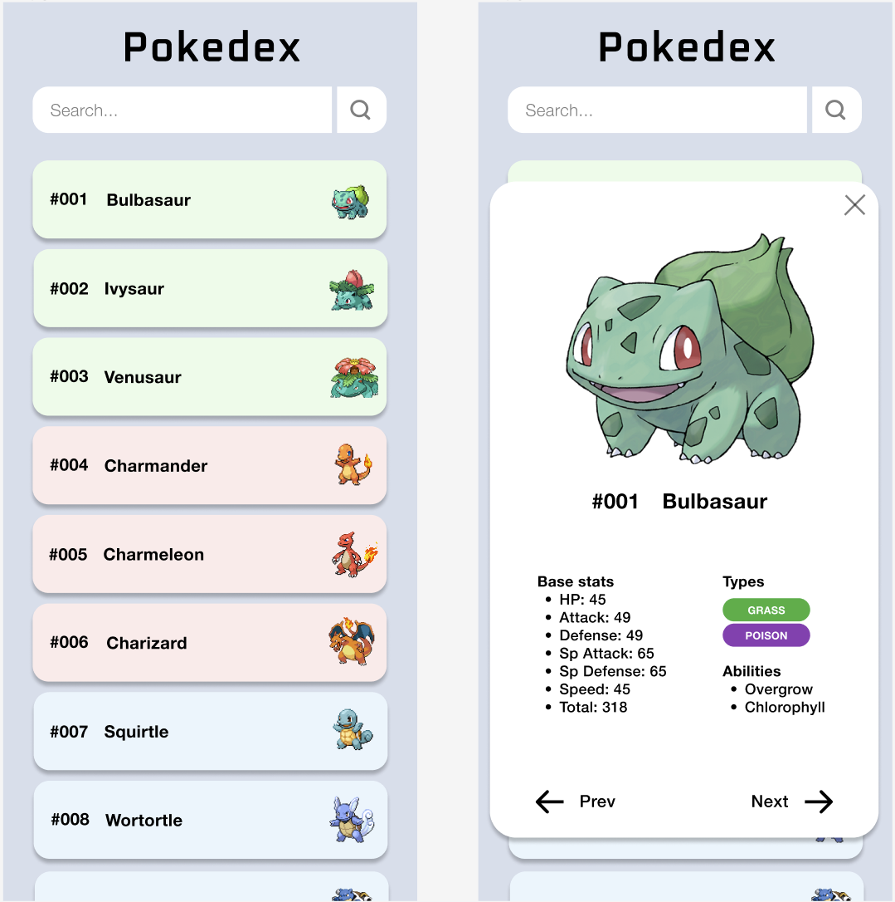
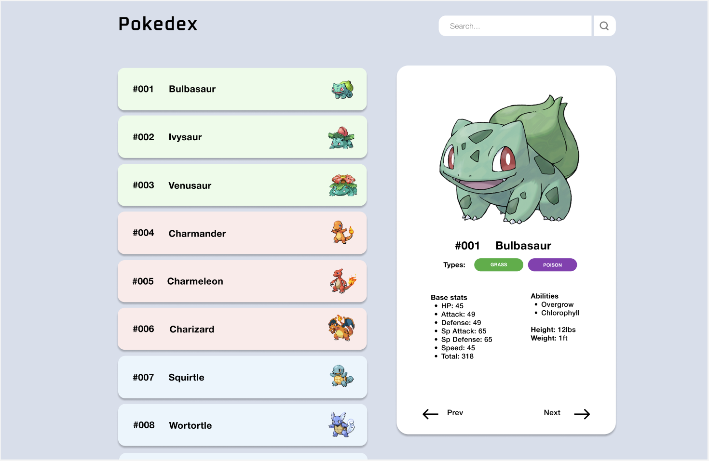

# Plan

## 1. Initialise & design app

✅ Read over test instructions\
✅ Create repo\
✅ Create Next.js project with TypeScript\
✅ Add Tailwind CSS to Next.js\
✅ Read PokeAPI docs

> _Note: It seems that the API is a RESTful API that returns JSON data. The API returns a list of Pokemon, and you can specify how many to fetch at a time. To get more pokemon, you need to pass in an offset parameter. The app will use this to paginate the list of Pokemon._

✅ Create branching strategy

> _Note: I will use the [Git Flow](https://nvie.com/posts/a-successful-git-branching-model/) branching strategy. Given the small scope of this project, I will use a single `main` branch and a single `develop` branch. I will use feature branches for each feature._

✅ Create wireframes

> _Note: I have decided to design this app mobile-first. As instructed, the app will display a list of pokemon on load and allow the user to search for a pokemon by name. The user will be able to click on a pokemon to view its details. The app will also display a loading state and an error state. I will use Tailwind CSS to style the app._

<!-- Images -->

✅ OOP or functional?

> _Note: I will use a functional approach because it is more suited to React/Next, particularly as this project has a defined scope. I will use React Hooks to manage state and side effects. I plan to use React Query to cache the data returned from the API. This means that when you navigate to a Pokemon's details page, the data is already in the cache and doesn't need to be fetched again._

✅ To TDD or Not To TDD?

> _Note: As this project is small in scope, I will not use TDD. I will write unit tests, integration tests, and e2e tests._

## 2. Create components

⏺️ Create `PokemonList` component\
⏺️ Create `PokemonCard` component\
⏺️ Ensure data is fetched and displayed\
⏺️ Create `Search` component\
⏺️ Make search functional\
⏺️ Create `Pagination` component\
⏺️ Make pagination/lazyloading functional\
⏺️ Create `PokemonDetails` component\
⏺️ Ensure detailed data is fetched and displayed

## 3. Testing

⏺️ Write unit tests\
⏺️ Write integration tests\
⏺️ Write e2e tests

## 4. Deployment

⏺️ Deploy to Netlify
